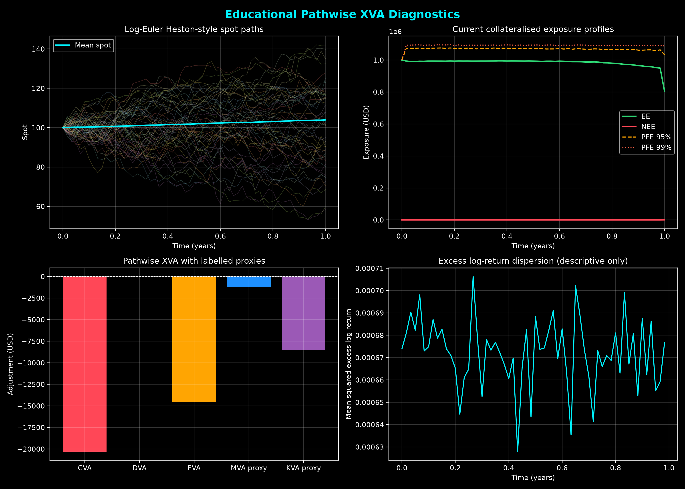
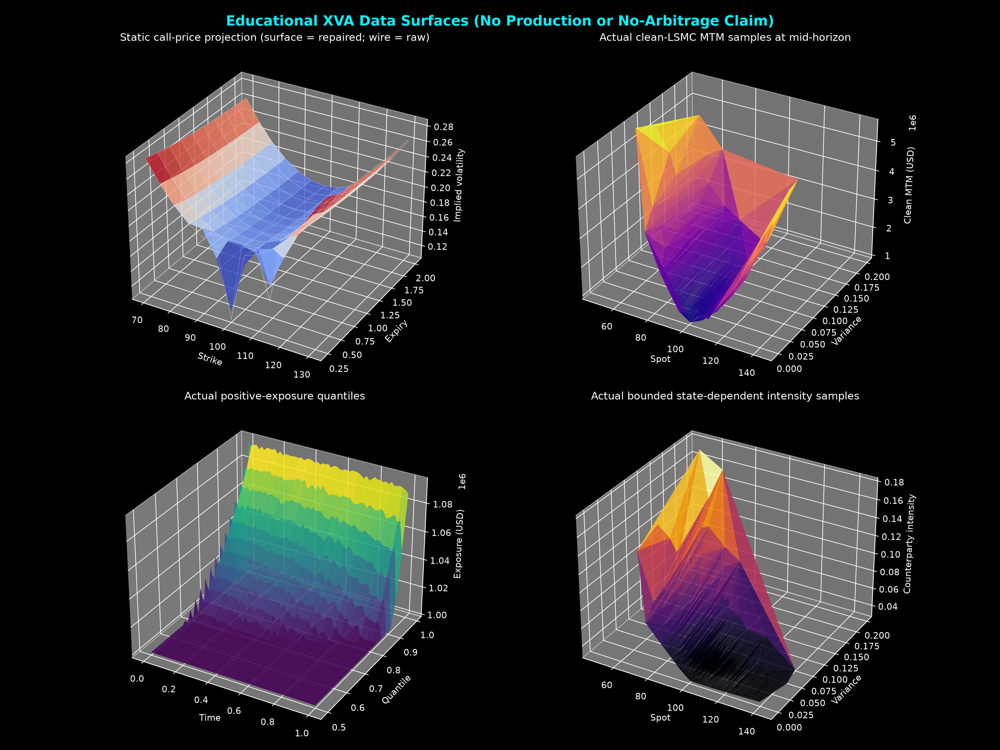

# XVA Simulation and Deep-BSDE Teaching Lab

This repository is an educational quantitative-finance lab. It demonstrates
pathwise exposure simulation, simplified XVA, collateral mechanics, a small
Deep-BSDE experiment, and a static option-surface repair.

It is not production software and must not be used for trading, regulatory
capital, accounting, credit approval, or counterparty-risk decisions.

## Generated diagnostics

The tracked charts below are produced by run_simulation.py from simulated
paths and static call-price repair. They are illustrative teaching outputs,
not calibration, validation, or a no-arbitrage certificate.

## What is implemented

- Reproducible risk-neutral log-spot, full-truncation variance, and short-rate
  simulation. Spot is evolved in log space so simulated prices remain positive.
- Bounded illustrative wrong-way-risk intensity stress driven by drawdown and
  variance. It is not a calibrated credit-intensity model.
- Pathwise first-to-default CVA and DVA. Discount factors, exposures, and
  intensities remain coupled on each Monte-Carlo path.
- Variation-margin threshold, minimum-transfer amount, call frequency, and
  margin-period-of-risk close-out exposure.
- A clean-price LSMC benchmark whose conditional-expectation regression can be
  augmented with the simulated variance and short-rate states, so the fitted
  mark-to-market depends on the stochastic state rather than on spot alone. It
  deliberately does not subtract XVA, so adjustments are not charged twice.
- Discounted spot Delta and Gamma from an initial-spot bump propagated through
  the simulated paths, rather than an additive shift of the terminal spot.
- Simplified funding-cost adjustment plus explicitly labelled IM and capital
  proxies for MVA and KVA.
- An optional Deep-BSDE teaching experiment that consumes the actual simulated
  Brownian increments rather than factor differences.
- Static Black-Scholes call-price projection with strike monotonicity,
  strike convexity, expiry monotonicity, and price-bound checks.

## Important limitations

- No calibrated curves, market data, trade representation, netting agreement,
  legal close-out model, real default simulation, or independent validation.
- The MVA and KVA results are teaching proxies, not ISDA SIMM, SA-CCR, or
  regulatory-capital calculations.
- The option-surface projection removes only the listed static constraints. It
  is not optimal transport, KL minimisation, a Dupire calibration, or a
  certification of dynamic no-arbitrage.
- Excess log-return dispersion is a descriptive statistic. It is not an
  arbitrage detector and cannot prove no-arbitrage.
- The Deep-BSDE result is a small numerical experiment. Convergence,
  calibration, and model-risk validation remain the user's responsibility.

## Project structure

    config.py                         Teaching assumptions
    models/stochastic_processes.py    Joint factor paths and actual dW increments
    xva/engine.py                     Collateral, MPOR, pathwise XVA, Greeks
    solvers/deep_bsde_solver.py       Clean LSMC and optional Deep-BSDE experiment
    solvers/surface_repair.py         Descriptive diagnostics and static repair
    run_simulation.py                 Data-backed 2D and 3D charts
    tests/test_engine.py              Numerical and behavioural tests

## Quickstart

Python 3.10 or later is recommended.

    python -m pip install -r requirements.txt
    python run_simulation.py
    python -m unittest discover tests -v

The default simulation writes two reproducible, data-backed PNG diagnostics.
To run the optional Deep-BSDE experiment as well:

    $env:RUN_DEEP_BSDE = "1"
    python run_simulation.py

## Validation approach

The test suite covers reproducibility, positive log-spot paths, discount-factor
normalisation, collateral call mechanics, MPOR exposure, a one-period
first-to-default CVA benchmark, pathwise WWR sensitivity, configurable
Deep-BSDE driver inputs, and static call-surface constraints.

Use the tests as educational regression checks, not as model validation.

## License

This project is released under the MIT License. See LICENSE.
